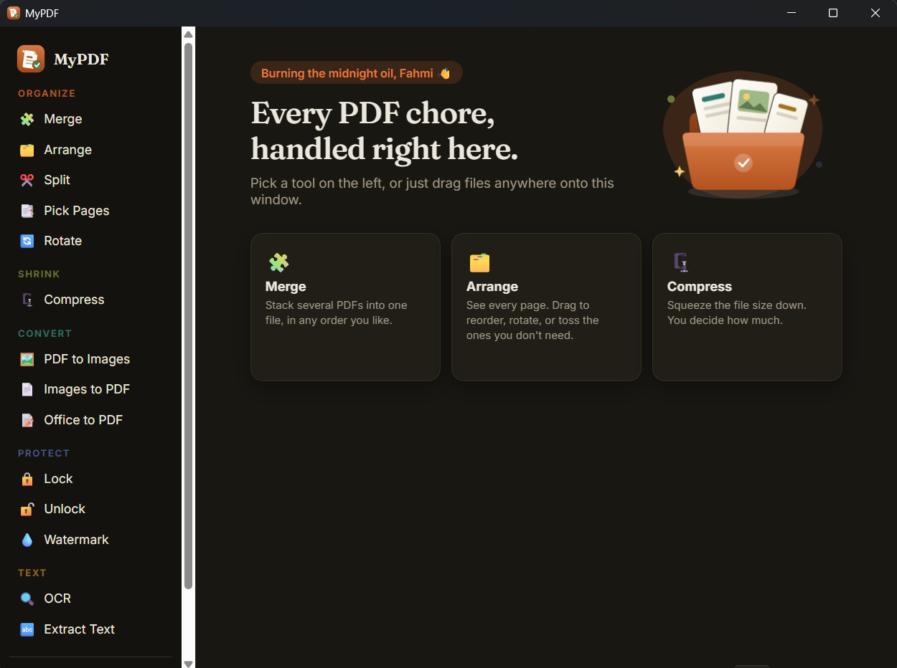

# MyPDF

**Every PDF chore, handled on your own machine.** MyPDF is a small, fast desktop
app for Windows that covers the everyday PDF workflow you would normally take to
an online converter, except nothing ever leaves your laptop. No uploads, no
accounts, no limits, no tracking. Built for people who handle sensitive
documents and would rather not send them to someone else's server.



## Features

| | |
|---|---|
| 🧩 **Merge** | Stack several PDFs into one, in any order |
| 🗂️ **Arrange** | See every page as a thumbnail. Drag to reorder, rotate, or remove pages |
| ✂️ **Split** | Break a PDF apart per page or by custom ranges |
| 📑 **Pick Pages** | Keep only the pages you need |
| 🗜️ **Compress** | Three presets plus full manual control over image resolution and JPEG quality |
| 🔄 **Rotate** | The whole file or selected pages |
| 🖼️ **PDF to Images** | Render pages as PNG or JPG |
| 📄 **Images to PDF** | Photos and scans into one tidy PDF |
| 📝 **Office to PDF** | Word, Excel, PowerPoint via LibreOffice |
| 🔒 **Lock / Unlock** | AES password protection, or remove it from your own files |
| 💧 **Watermark** | Faint text across every page |
| 🔍 **OCR** | Make scans searchable, with live per page progress |
| 🔤 **Extract Text** | All the text into a .txt file |

Plus the small things that make it pleasant: drag and drop anywhere, page
thumbnails with file info, live progress bars, a recent work history, output
files that never overwrite existing ones, and a settings page for your default
OCR language and output folder.

## How it works

```
React UI  →  thin Tauri (Rust) command  →  Python engine (stdin/stdout JSON)
```

The interface is React + TypeScript in a Tauri shell. All PDF logic lives in a
single Python engine ([engine/pdf_engine.py](engine/pdf_engine.py)) built on
PyMuPDF and pikepdf, which streams JSON progress lines so the UI can show real
percentages. Heavier features call battle tested externals per task:
Ghostscript for compression, LibreOffice for Office conversion, and
Tesseract + ocrmypdf for OCR.

## Requirements

To run the app you need:

- **Python 3.10+** with `pip install pikepdf pymupdf pillow`

Optional, per feature (the app detects what is installed and tells you):

| Feature | Tool |
|---|---|
| Strong compression | [Ghostscript](https://ghostscript.com) |
| Office to PDF | [LibreOffice](https://libreoffice.org) |
| OCR | [Tesseract](https://github.com/UB-Mannheim/tesseract) plus `pip install ocrmypdf` |

For OCR in languages beyond English, place the matching `.traineddata` from
[tessdata_fast](https://github.com/tesseract-ocr/tessdata_fast) into your
tessdata folder (set `TESSDATA_PREFIX` if you keep it outside the Tesseract
install directory).

## Development

Prerequisites: Node.js, Rust (MSVC toolchain on Windows), Python 3.10+.

```powershell
npm install
npm run tauri dev      # run in development
npm run tauri build    # produce the installer (MSI + NSIS)
```

The engine also works standalone, which makes it easy to test:

```powershell
echo '{"task":"doctor","params":{}}' | python engine/pdf_engine.py
```

## Privacy

Everything runs locally. The app makes no network requests: fonts are bundled,
processing is on device, and your files stay in your folders.

## License

[AGPL 3.0](LICENSE). The engine builds on [PyMuPDF](https://github.com/pymupdf/PyMuPDF)
(AGPL licensed), so this project shares the same license. In short: use it,
modify it, ship it, but keep the source open.

## Contributing

Issues and pull requests are welcome. Adding a new tool is usually one Python
function in `engine/pdf_engine.py` plus one entry in the tool list in
`src/App.tsx`.
